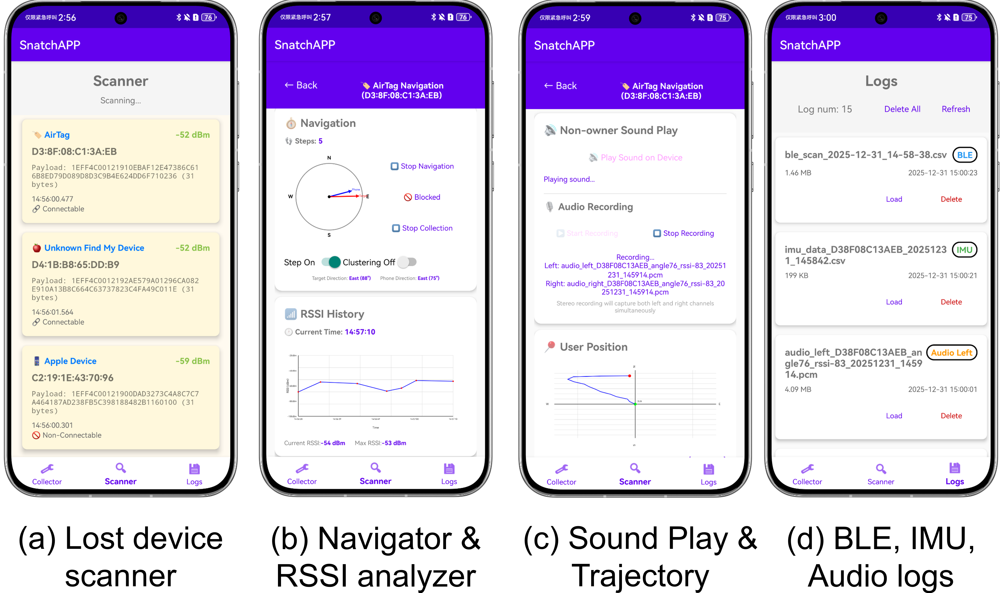
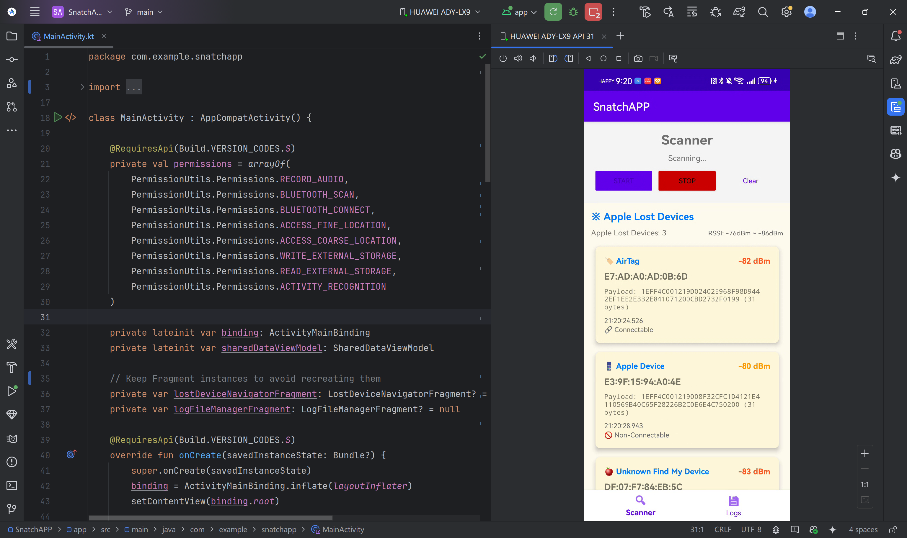

# Snatcher 🛡️

Artifact for the paper *"Snatcher: Apple Find My Network Exposes Your Lost
Devices To Strangers"* (ACM CCS 2026). Snatcher is an Android-based attack-and-analysis
framework that shows how insecure BLE advertisements, unauthenticated acoustic
triggers, and slow MAC-address randomization in Apple's Find My network expose
lost devices to discovery, tracking, and physical theft.

📄 Full appendix: [`doc/Snatcher_AE.pdf`](./doc/Snatcher_AE.pdf) &nbsp;·&nbsp;
📦 Archive: [Zenodo (concept DOI — always the latest version)](https://doi.org/10.5281/zenodo.20693210)



## ⚠️ Responsible-disclosure partial release

| What | Status |
| :--- | :--- |
| `SnatchAPP` — lost-device **discovery** + non-owner **sound trigger** + RSSI/IMU **logging** | ✅ released (incl. prebuilt APK) |
| `esp32_airtag_mac_rotation`, `esp32_sound_maker` firmware | ✅ released in full |
| `reproduce/` — representative traces + offline analysis code (Levels 1–3) | ✅ released |

`SnatchAPP`'s real-time navigation- and clustering-assistance modules are
withheld; their algorithms are still **validated offline** by the trace-based
reproduction (Path B below), so nothing essential to the paper's claims is lost.



## TL;DR — two ways to evaluate

| Path | What it shows | Needs | Time |
| :--- | :--- | :--- | :--- |
| **A. Live on-device demo (E0)** | Install one APK and watch the attack discover the **real** lost Apple devices around you and play their sound | An Android 7.0+ phone | ~10 min |
| **B. Offline reproduction (E1–E7)** | Pure-Python scripts reproduce the paper's figures/tables from shipped traces — **no Apple hardware** | Any PC with Python 3.8+ | ~30 min |

Do either or both. Path B is the primary, hardware-free verification; Path A is the
compelling on-device demo we **strongly encourage** you to try.

---

## A. Live on-device demo (strongly recommended)

One-minute install, no build — and it works on real hardware.

1. **Install the app.** Download **[`SnatchAPP.apk`](https://github.com/rzy0901/Snatcher/raw/main/SnatchAPP/SnatchAPP.apk)**
   and install it on any Android 7.0+ phone — open the file on the device and allow
   *"install unknown apps"*, or:
   ```bash
   adb install -r SnatchAPP.apk
   ```
   On first launch, grant the Bluetooth, location, microphone, physical-activity, and
   storage permissions.
2. **Discover real lost devices (Vuln. I).** Open the **Scanner**. In almost any
   public space it lists the **real Apple devices already in the Separated (Lost)
   state** broadcasting around you — type, MAC, RSSI, and Find My payload. No pairing,
   no owner account.
3. **Trigger non-owner sound (Vuln. II).** Tap a connectable device → **Play Sound &
   Record**. With no authentication, the app connects and plays its alert sound while
   recording stereo audio (the Level-1 acoustic input). *Try it against an
   AirTag/AirPods you own placed in Lost mode, or the provided `esp32_sound_maker`.*
4. **Passive RSSI/IMU logging (Vuln. III).** The data-collection screen logs the
   target's RSSI together with the phone's IMU/PDR motion — the inputs that the
   navigation and clustering analyses (Path B) consume.

> ⚠️ Only scan around, trigger sound on, or track devices **you own**. See
> [Security & ethics](#-security-privacy-and-ethics).

## B. Offline reproduction — no Apple hardware

### Step 1 — set up (once)
```bash
cd reproduce
python -m venv .venv && source .venv/bin/activate    # Windows: .venv\Scripts\activate
pip install -r requirements.txt                       # numpy, scipy, pandas, matplotlib
```

### Step 2 — basic test
```bash
cd 3_acoustic_direction && python acoustic_example.py
```
**Expected:** detects the AirTag chirp arrivals and prints the signal level
**≈ −42.8 dB** — confirming the toolchain is correctly installed.

### Step 3 — reproduce the paper's results
Each example runs offline from a small shipped `data/` trace, prints a result, and
writes a figure.

**E1 — Lost-state onset** · paper **Fig. 3**
```bash
cd reproduce/1_timeout_disconnect_distance
python plot.py
```
*Expected:* per-device lost-state timeout + owner-to-device disconnect distance.

**E2 — MAC-address rotation period** · paper **Table 2**
```bash
cd reproduce/2_mac_rotation
python make_table.py
```
*Expected:* AirTag/AirPods ~24 h, iPhone ~15 min, Apple Watch 19–36 min.

**E3 — Acoustic direction finding (Level 1)** · paper **Fig. 6**
```bash
cd reproduce/3_acoustic_direction
python plot_waveform_spectrogram.py
python acoustic_example.py
python plot_direction_polar.py
```
*Expected:* signal level ≈ **−42.8 dB**; estimated direction = **Front**.

**E4 — RSSI–IMU navigation (Level 2)** · paper **Fig. 8**
```bash
cd reproduce/4_rssi_navigation
python plot_trace.py
```
*Expected:* walked trajectory; RSSI rises **−81 → −39 dBm**.

**E5 — Spatial–temporal clustering (Level 3)** · paper **Fig. 11**
```bash
cd reproduce/5_clustering
python cluster.py --log data/clustering_log_3dev.csv   # 3 devices
python cluster.py                                       # 2 devices
```
*Expected:* accuracy **99.3 %** (3 devices) / **100 %** (2 devices).

**E6 — Maximum attack distance** · paper **Fig. 14–15**
```bash
cd reproduce/6_max_distance
python plot_max_distance.py
```
*Expected:* RSSI and sound-level vs distance, 0–80 m.

**E7 — End-to-end navigation traces** · paper **Fig. 17**
```bash
cd reproduce/7_navigation_traces
python plot_traces.py
```
*Expected:* three sample navigation trajectories (one per attack level).

Every folder's own `README.md` documents the input format, the command, and the
expected output in detail.

**Where the data lives:** each example reads its processed trace from its own `data/`
folder. The bulkier raw scan logs are retained locally (available on request);
`1_timeout_disconnect_distance/`, `2_mac_rotation/`, and `6_max_distance/` additionally
ship a representative raw capture under `raw/` so the raw→trace derivation can be inspected.

---

## 📁 Repository structure

```text
Snatcher/
  SnatchAPP/                  # Android sound-play app (paper Table 1)
    SnatchAPP.apk             #   -> prebuilt, signed, installable (Path A)
  esp32_airtag_mac_rotation/  # mimicked-AirTag firmware (paper Fig 11)
  esp32_sound_maker/          # non-owner sound-trigger firmware (paper Table 1)
  reproduce/                  # example traces + Python analysis (Path B)
    1_timeout_disconnect_distance/  # lost-state onset   (paper Fig 3)
    2_mac_rotation/                 # MAC-rotation period (paper Table 2)
    3_acoustic_direction/           # Level 1 direction   (paper Fig 6)
    4_rssi_navigation/              # Level 2 RSSI–IMU nav (paper Fig 8)
    5_clustering/                   # Level 3 clustering   (paper Fig 11)
    6_max_distance/                 # max attack range     (paper Fig 14,15)
    7_navigation_traces/            # end-to-end traces    (paper Fig 17)
  doc/                        # artifact-evaluation appendix (Snatcher_AE.pdf)
  README.md   LICENSE
```

In total the artifact reproduces the paper's **Figures 3, 6, 8, 11, 14, 15, and 17**
and **Tables 1 and 2**.

## Building from source (optional)

The prebuilt APK above already covers Path A; build from source only if you want to.

- **Android app** (`SnatchAPP/`): open it in [Android Studio](https://developer.android.com/studio)
  (*Run* installs it), or from the command line:
  ```bash
  cd SnatchAPP
  ./gradlew assembleRelease
  adb install -r app/build/outputs/apk/release/app-release.apk
  ```
- **ESP32 firmware** (`esp32_airtag_mac_rotation/`, `esp32_sound_maker/`): build and
  flash with [ESP-IDF](https://github.com/espressif/esp-idf):
  ```bash
  cd esp32_sound_maker            # or esp32_airtag_mac_rotation
  idf.py set-target esp32
  idf.py menuconfig               # Bluetooth controller: BLE Only + Bluedroid
  idf.py -p <PORT> flash monitor
  ```
  Before building, set the target in source: `DEVICE_ID` and the MAC-rotation period
  (10–60 s) in `openhaystack_main.c` (mimicked AirTag), and `device_type` + `target_mac`
  in `main.c` (sound trigger — read the target's MAC with `SnatchAPP` or nRF Connect).

## Hardware (for Path A / the firmware)

- An **Android 7.0+ phone** with BLE, a stereo microphone, and a 9-axis IMU.
- *Optionally,* **ESP32-WROVER-Kit** boards (the boards we used; ESP32-S3/C3 also work)
  for the controlled mimicked-AirTag and sound-trigger targets, and/or a real Apple
  device you own (AirTag/AirPods/iPhone/Apple Watch) **signed into an Apple ID and
  placed in the Separated (Lost) state**, to test against production hardware.

## 🔒 Security, privacy, and ethics

Snatcher is offensive — it can discover, actuate, and physically localize Apple Find
My devices that are not the operator's. Evaluate it **only** against devices you own
(your own Apple devices, or the provided ESP32 targets); never trigger sound on,
connect to, or track a third party's device. To avoid misuse, the released app omits
the real-time on-device navigation- and clustering-assistance modules; the trace-based
reproduction validates those algorithms offline.

## How to cite / archive

Archived on Zenodo — please cite the **concept DOI**, which always resolves to the
latest version: **[10.5281/zenodo.20693210](https://doi.org/10.5281/zenodo.20693210)**.

## References

- [AirGuard](https://github.com/seemoo-lab/airguard) ·
  [OpenHaystack](https://github.com/seemoo-lab/openhaystack)

## License

Licensed under the [GNU AGPL-3.0](./LICENSE). The ESP32 firmware derives from
[OpenHaystack](https://github.com/seemoo-lab/openhaystack), which is also AGPL-3.0.

---
*This is a deliberately partial release that balances reproducibility with
responsible disclosure. Released for research and educational purposes only; use
only against devices you own.*
